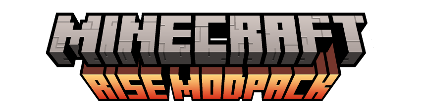
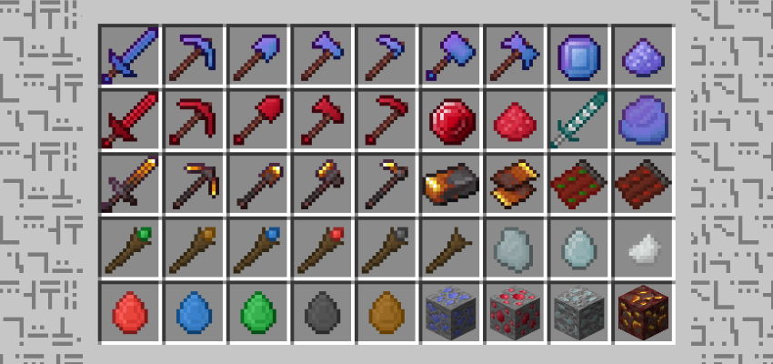

# Rise: Ores n Magics v0.6

> Explore <strong>Rise: Ores n Magics</strong> elevates your vanilla experience, without replacing or getting in the way, but rather complementing and expanding.

 

- Light mods with easy installation;
- Vanilla-like textures and features;
- Balanced to survival experience.

 

### Docs n Stats

 

### Possible New Mods

- [ ] Platinum;
- [ ] Pure Diamond;
- [ ] End Cristals;
- [ ] Wands.

### Linguagens e Tecnologias

### Author

<table>
  <tr>
    <td align="center">
      <a href="https://github.com/romhenri">
         
        

          <b>Rômulo Henri</b>
        

      </a>
    </td>
    <td align="center">
        

          Mod that is part of the "Rise: Ores n Magic" Modpack, developed by me in both code and art.
           
          Available at
          <a href="https://www.curseforge.com/minecraft/modpacks/rise-modpack" target="_blank">CurseForge</a>
          
 
        (Since 2024)
    </td>
  </tr>
</table>

