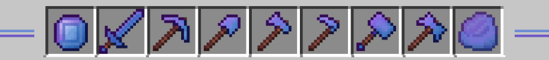

> Discover the power of  <strong>Alexandrite Ore!</strong> A new useful and beautiful ore for your Minecraft world. Make amazing strong tools to your journey.

 

- Light mod with easy installation;
- Vanilla-like textures and features;
- Balanced to survival experience.

 

### Docs n Stats

Discover ore between -24 and -54.  
You can smelt Raw to get Alexandrite and it to get Dust.  
Tools craftings are vanilla-like and has block.  

Alexandrite tools are better stats than Netherite, except sword.  
Alexandrite sword has Diamond damage, but is faster than all.  
Alexandrite can be found in ruined portals, villages and jungle dungeon.

 

### Possible Updates

- [x] Tools;
- [ ] Ultra-tools;
- [ ] Armor.

### Author

<table>
  <tr>
    <td align="center">
      <a href="https://github.com/romhenri">
         
        

          <b>Rômulo Henri</b>
        

      </a>
    </td>
    <td align="center">
        

          Mod that is part of the "Rise: Ores n Magic" Modpack, developed by me in both code and art.
           
          Available at
          <a href="https://www.curseforge.com/minecraft/modpacks/rise-modpack" target="_blank">CurseForge</a>
          
 
        (Since 2024)
    </td>
  </tr>
</table>

<!-- 

<table>
  <tr>
    <td align="center">
      <a href="https://github.com/romhenri">
         
        

          <b>Rômulo Henri</b>
        
      </a>
    </td>
    <td align="center">
        
Mod que faz parte do Modpack Rise: Ores n Magic, desenvolvido por mim tanto em código quanto em artes.   Disponível em https://www.curseforge.com/minecraft/modpacks/rise-modpack
  
        (2024)
    </td>
  </tr>
</table>
 -->