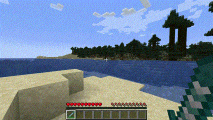
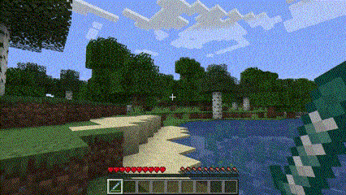

# Boost Sword v1.0.0

> A powerful Sword with <strong>Boost Power</strong>, a unique and fun way to move, travel and escape from difficult situations.

 

- Light mod with easy installation;
- Vanilla-like textures and features;
- Balanced to survival experience.

 

 

### Docs n Stats

Find Boost Sword in End treasures;  
Press Right Click and be boosted; 
Damage and Durability equivalent to a diamond sword; 
Works extremely well with Elytra.

 

### Possible Updates

- [x] Boost Sword;
- [ ] Low Boost Sword;

### Author

<table>
  <tr>
    <td align="center">
      <a href="https://github.com/romhenri">
         
        
          <b>Rômulo Henri</b>
        
      </a>
    </td>
    </tr>
</table>