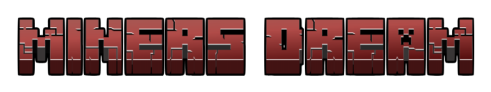
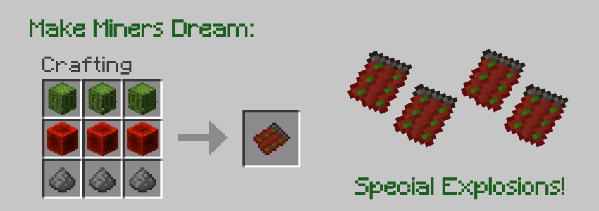

# Miners Dream v1.0.0

> Special mining experience with the<strong>Miners Dream</strong> explosive. OreSpawn inspired.

 

### Docs n Stats

1. Get cactus, redstones blocks and gunpowders;
2. Make the explosive that is a miner's dream;
3. Click in block in line of sight to explode and make the tunnel.

 

### Possíveis Atualizações

- [x] Miners Dream;
- [ ] Vertical Miners Dream;
- [ ] Nether Miners Dream;
- [ ] End Miners Dream.

### Linguagens e Tecnologias

### Author

<table>
  <tr>
    <td align="center">
      <a href="https://github.com/romhenri">
         
        

          <b>Rômulo Henri</b>
        

      </a>
    </td>
    <td align="center">
        

          Mod that is part of the "Rise: Ores n Magic" Modpack, developed by me in both code and art.
           
          Available at
          <a href="https://www.curseforge.com/minecraft/modpacks/rise-modpack" target="_blank">CurseForge</a>
          
 
        (Since 2024)
    </td>
  </tr>
</table>

