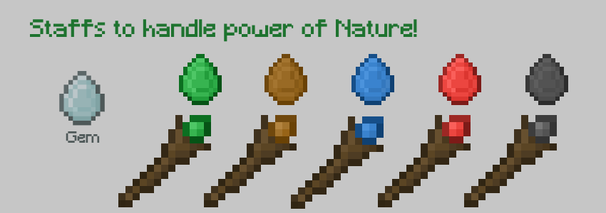

# Nature Staffs v1.0.0

> Handle the power of nature with Magic Staffs! 

 

- Light mod with easy installation;
- Vanilla-like textures and features;
- Balanced to survival experience.

 

### Docs n Stats

Find Gems in Mineral Ores;  
Make Elemental Gems; 
Make Staffs; 
Use Right Click to Make Plataforms. 

### Author

<table>
  <tr>
    <td align="center">
      <a href="https://github.com/romhenri">
         
        
          <b>Rômulo Henri</b>
        
      </a>
    </td>
    </tr>
</table>