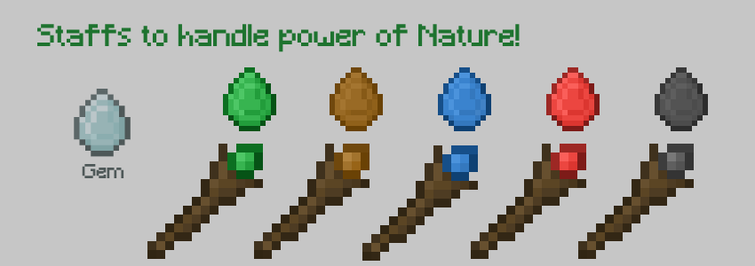
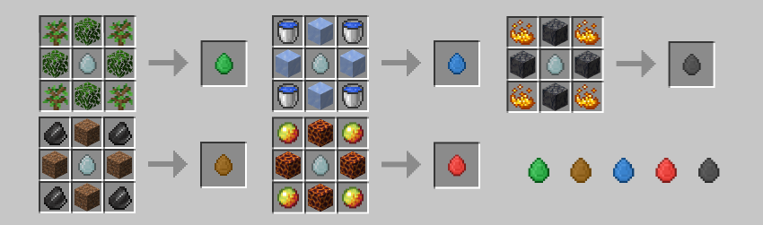
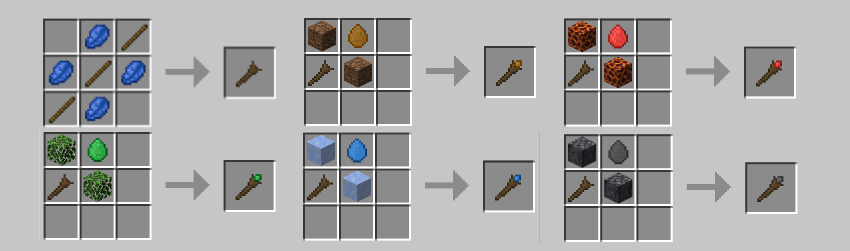

# Nature Staffs v1.0.0

> Handle the power of nature with Magic Staffs! 

 

- Light mod with easy installation;
- Vanilla-like textures and features;
- Balanced to survival experience.

 

### Docs n Stats

Find Gems in Mineral Ores;  
Make Elemental Gems; 
Make Staffs; 
Use Right Click to Make Plataforms. 

### Possible Updates

- [x] Material Staffs;
- [ ] Actions Staffs.

### Author

<table>
  <tr>
    <td align="center">
      <a href="https://github.com/romhenri">
         
        

          <b>Rômulo Henri</b>
        
      </a>
    </td>
    <td align="center">
        
Mod que faz parte do Modpack Rise: Ores n Magic, desenvolvido por mim tanto em código quanto em artes.   Disponível em https://www.curseforge.com/minecraft/modpacks/rise-modpack
  
        (2024)
    </td>
  </tr>
</table>